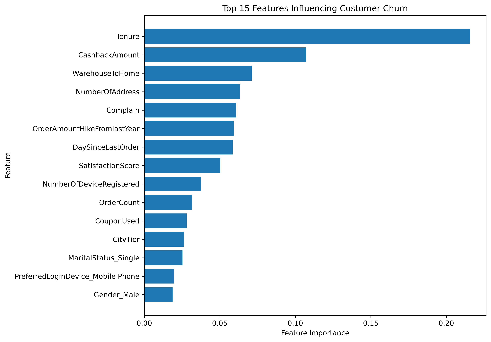
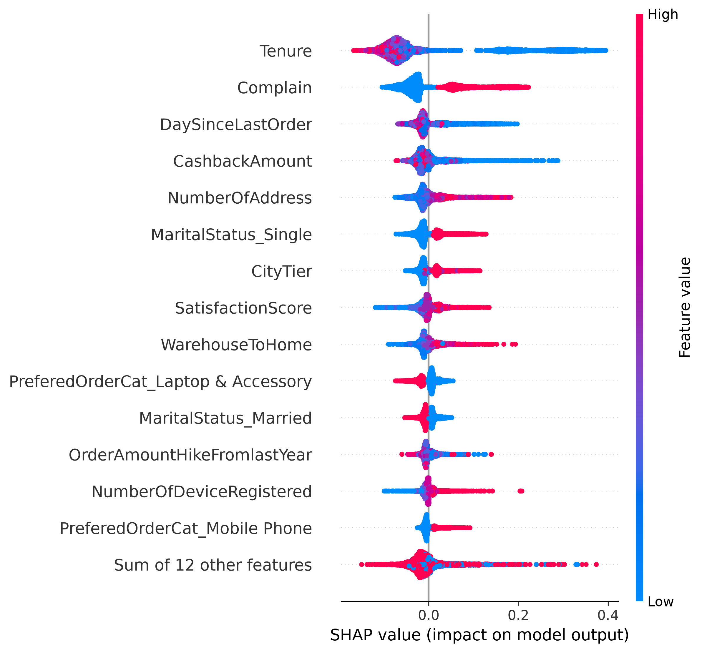
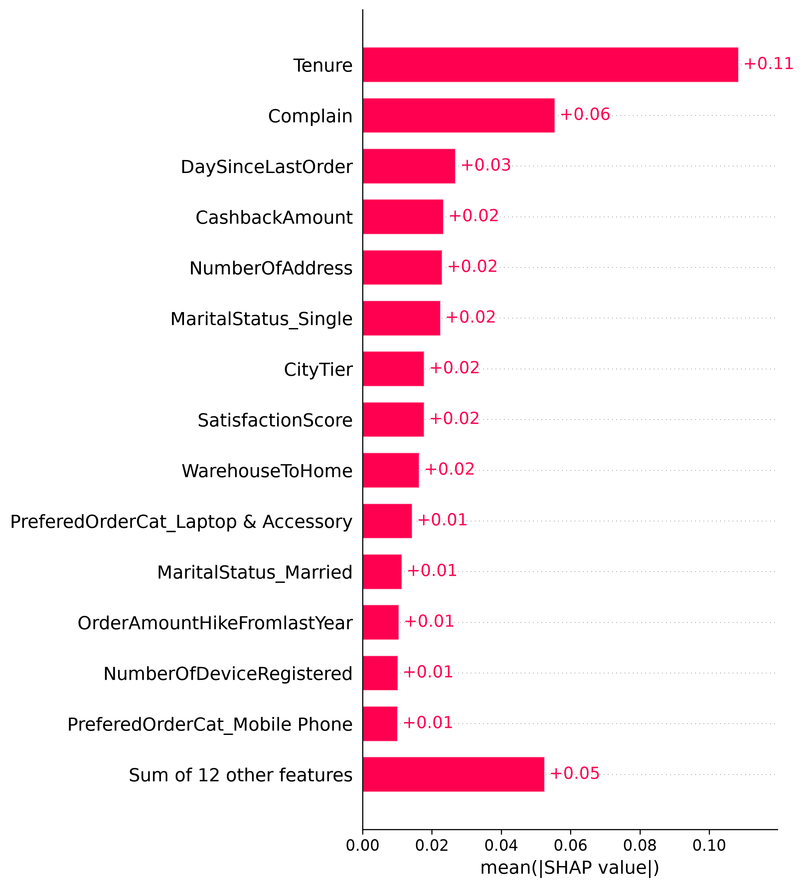
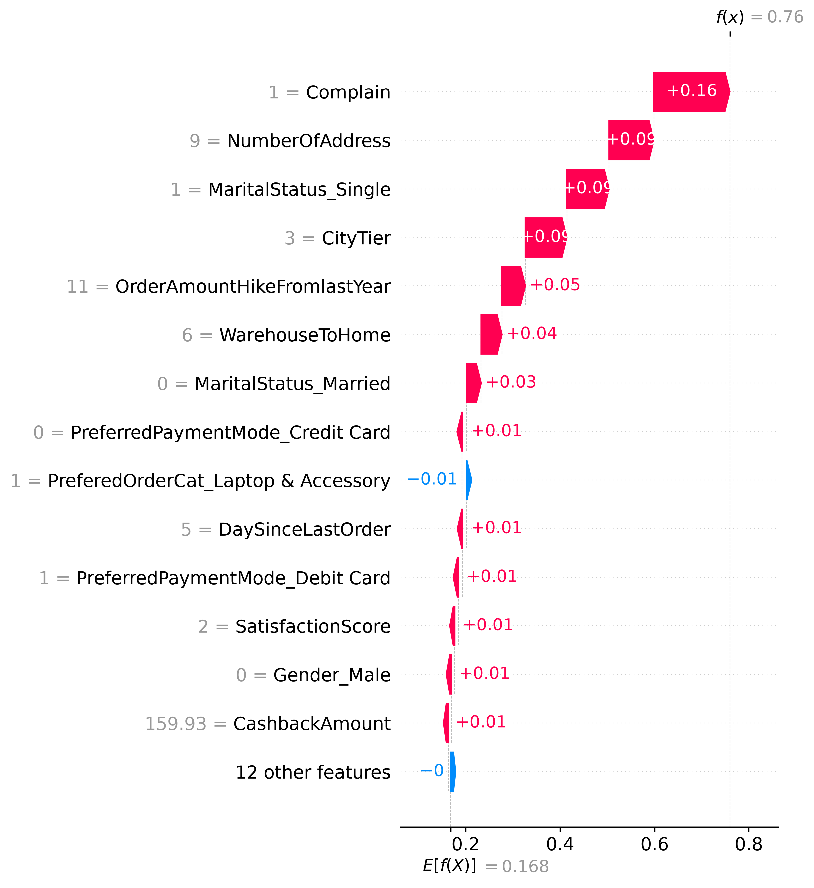
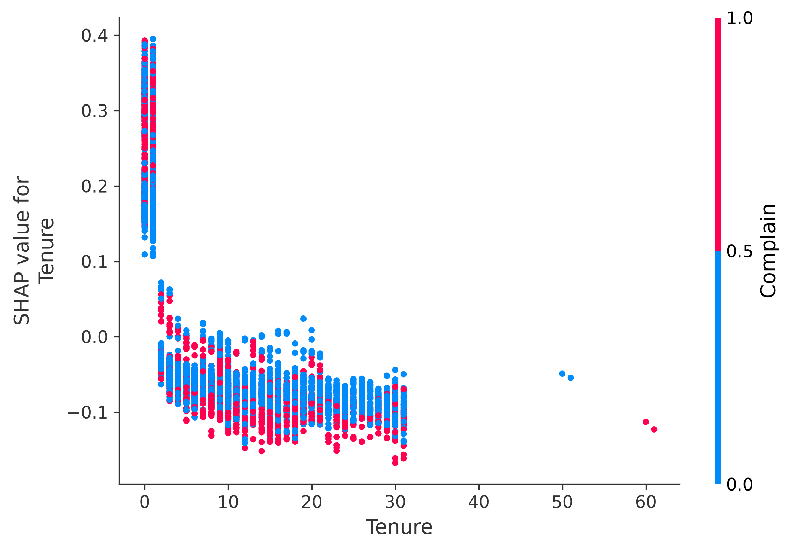
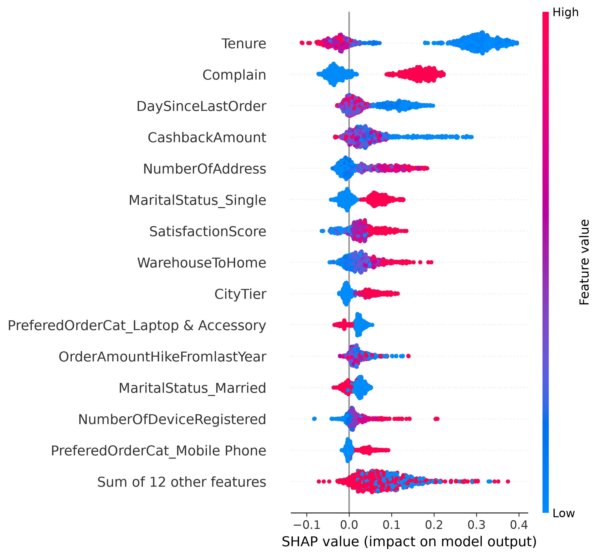
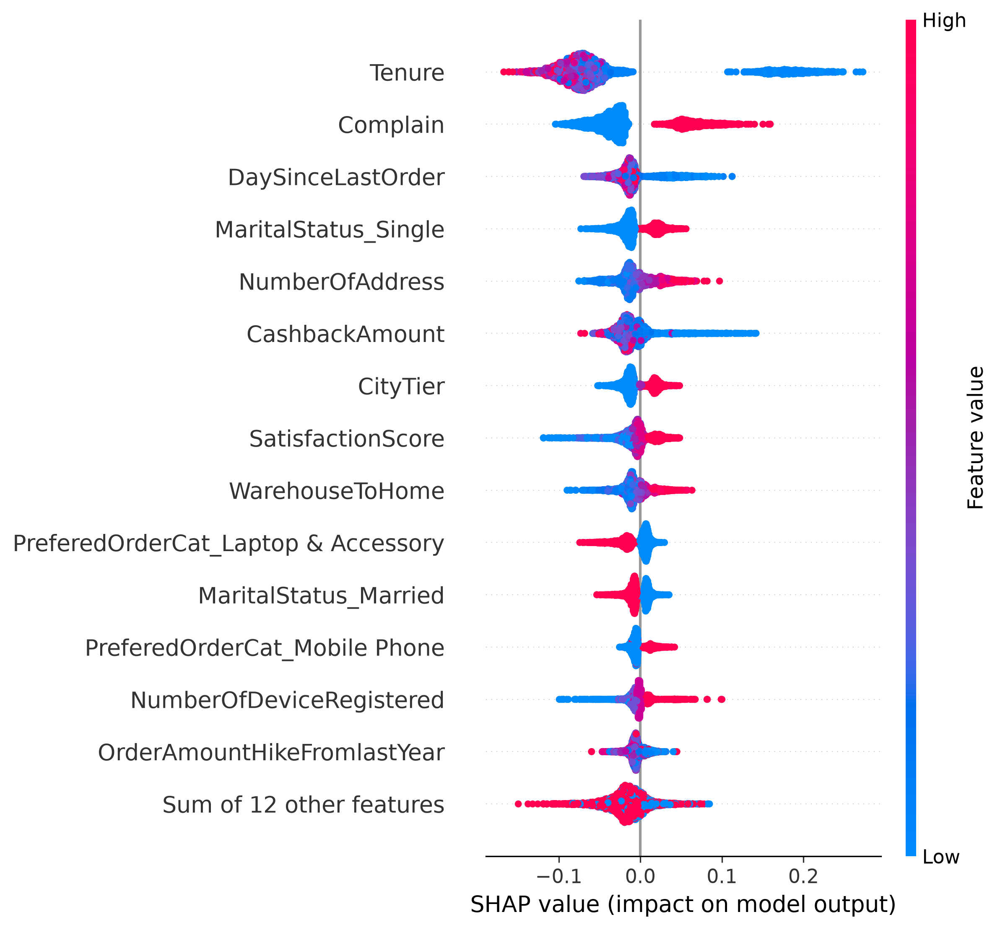

# RetailGenius Customer Churn Prediction

RetailGenius is an end-to-end machine learning project for predicting customer churn in an e-commerce environment.

The project demonstrates a complete machine learning workflow, including data preparation, feature engineering, model training and evaluation, hyperparameter tuning, explainable AI (XAI), experiment tracking, model registration, and local model serving.

The final model is a tuned Random Forest classifier packaged together with its preprocessing steps in a Scikit-learn pipeline, allowing predictions to be made directly from raw customer data.

---

## Business Problem

Customer churn occurs when customers stop purchasing from or interacting with a business. For an e-commerce company, identifying customers who are likely to churn can help the business take proactive retention measures before those customers leave.

RetailGenius addresses this problem by using historical customer information, including purchasing behaviour, tenure, satisfaction, complaints, order activity, and other customer characteristics, to estimate whether a customer is likely to churn.

---

## Project Objectives

The objectives of this project are to:

- Predict whether an e-commerce customer is likely to churn.
- Compare classification models using appropriate evaluation metrics.
- Improve model performance through cross-validation and hyperparameter tuning.
- Package preprocessing and prediction logic into a reusable machine learning pipeline.
- Explain model behaviour and predictions using feature importance and SHAP.
- Track model experiments, parameters, metrics, and artifacts using MLflow.
- Register the selected model using MLflow Model Registry.
- Serve the trained model through a local inference endpoint.

---

## Dataset

The project uses an e-commerce customer churn dataset containing **5,630 customer records**.

The target variable is:

- `Churn = 0`: Customer did not churn.
- `Churn = 1`: Customer churned.

After data preparation, the model uses **18 input features** describing customer demographics, purchasing behaviour, engagement, satisfaction, complaints, and transaction activity.

The dataset is imbalanced, with approximately:

- **83% non-churn customers**
- **17% churn customers**

### Input Features

The model uses the following features:

- Tenure
- CityTier
- WarehouseToHome
- HourSpendOnApp
- NumberOfDeviceRegistered
- SatisfactionScore
- NumberOfAddress
- Complain
- OrderAmountHikeFromlastYear
- CouponUsed
- OrderCount
- DaySinceLastOrder
- CashbackAmount
- PreferredLoginDevice
- PreferredPaymentMode
- Gender
- PreferedOrderCat
- MaritalStatus

Categorical variables are handled using one-hot encoding within the Scikit-learn preprocessing pipeline.

`handle_unknown="ignore"` is used so that previously unseen categories can be processed during inference without manually creating dummy-variable columns.

---

## Project Structure

```text
retailgenius-churn-prediction/
│
├── data/
│   └── processed/                 # Cleaned and processed datasets
│
├── models/
│   └── random_forest_churn_model.pkl
│                                  # Locally saved trained pipeline
│
├── notebooks/                     # Exploratory notebooks
│
├── outputs/
│   ├── feature_importance.png     # Random Forest feature importance
│   └── shap/                      # SHAP explainability outputs
│       ├── beeswarm_plot.png
│       ├── dependence_plot.png
│       ├── force_plot.html
│       ├── mean_shap_plot.png
│       ├── summary_churn.png
│       ├── summary_non_churn.png
│       └── waterfall_plot.png
│
├── src/
│   ├── data_preparation.py        # Data cleaning and preparation
│   ├── feature_engineering.py     # Feature engineering
│   ├── train.py                   # Training, evaluation and tuning
│   ├── test_model.py              # Model testing
│   ├── predict.py                 # Prediction on new customer data
│   ├── explain_model.py           # SHAP explainability
│   └── mlflow_tracking.py         # MLflow experiment tracking
│
├── tests/                         # Project tests
├── .gitignore
├── README.md
└── requirements.txt
```

---

## Machine Learning Workflow

The project follows an end-to-end machine learning workflow:

**Data Preparation → Feature Engineering → Train/Test Split → Preprocessing → Model Training → Model Evaluation → Cross-Validation → Hyperparameter Tuning → Explainability → Experiment Tracking → Model Registration → Model Serving**

### 1. Data Preparation

The raw customer data is cleaned and standardized before modelling.

Categorical values are standardized where necessary to ensure that equivalent categories are represented consistently.

### 2. Train/Test Split

The dataset is divided into:

- **80% training data**
- **20% test data**

A stratified split is used to preserve the churn/non-churn class distribution in both datasets.

A fixed `random_state=42` is used for reproducibility.

### 3. Preprocessing Pipeline

Five categorical variables are transformed using `OneHotEncoder`:

- PreferredLoginDevice
- PreferredPaymentMode
- Gender
- PreferedOrderCat
- MaritalStatus

Numerical variables pass through the `ColumnTransformer` unchanged.

Preprocessing is included inside the Scikit-learn pipeline so that the same transformations used during training are automatically applied during inference.

---

## Models

Two classification models are evaluated.

### Logistic Regression

Logistic Regression is used as a baseline classification model.

Feature scaling is included in the Logistic Regression pipeline using `StandardScaler`.

### Random Forest

Random Forest is used as the primary tree-based model.

The model is evaluated using:

- Hold-out test data
- 5-fold cross-validation
- GridSearchCV hyperparameter tuning

The selected Random Forest parameters are:

```text
n_estimators       = 200
max_depth          = 20
min_samples_split  = 2
min_samples_leaf   = 1
random_state       = 42
```

---

## Model Performance

### Logistic Regression Baseline

| Metric | Score |
|---|---:|
| Accuracy | 0.8934 |
| Precision | 0.7612 |
| Recall | 0.5368 |
| F1 Score | 0.6296 |
| ROC-AUC | 0.8869 |

### Tuned Random Forest

| Metric | Score |
|---|---:|
| Accuracy | **0.9849** |
| Precision | **0.9943** |
| Recall | **0.9158** |
| F1 Score | **0.9534** |
| ROC-AUC | **0.9992** |

The tuned Random Forest confusion matrix on the test set is:

```text
[[935   1]
 [ 16 174]]
```

This means that, on the test set, the model produced:

- 935 true negatives
- 174 true positives
- 1 false positive
- 16 false negatives

The Random Forest therefore substantially outperformed the Logistic Regression baseline on the evaluation metrics used in this project.

---

## Cross-Validation

The Random Forest model was also evaluated using **5-fold cross-validation** on the training data.

The ROC-AUC scores were approximately:

```text
0.9814
0.9720
0.9831
0.9728
0.9807
```

Mean ROC-AUC:

```text
0.9780
```

Standard deviation:

```text
0.0047
```

The relatively small variation across folds indicates consistent performance across the cross-validation splits.

---

## Feature Importance

Random Forest feature importance is used as an initial global interpretation of the model.

The most influential features include:

- Tenure
- CashbackAmount
- WarehouseToHome
- NumberOfAddress
- Complain
- OrderAmountHikeFromlastYear
- DaySinceLastOrder
- SatisfactionScore

The generated visualization is available below:



Feature importance indicates how strongly features contribute to the model's decisions. It does **not** by itself indicate whether increasing a feature increases or decreases churn risk.

---

## Explainable AI with SHAP

SHAP (SHapley Additive exPlanations) is used to provide more detailed explanations of the Random Forest model.

A SHAP `TreeExplainer` computes Shapley values for the transformed customer dataset.

The explainability analysis includes both global and individual explanations.

### SHAP Beeswarm Plot

The beeswarm plot provides a global view of how features influence model predictions across customers.



### Mean SHAP Feature Importance

Mean absolute SHAP values provide another global measure of feature influence.



### Individual Customer Explanation

A waterfall plot is used to explain the contribution of individual features to the prediction for a specific customer.



An interactive SHAP force plot is also generated:

`outputs/shap/force_plot.html`

### Dependence Plot

A SHAP dependence plot is generated for the most important Random Forest feature to examine how its values relate to its contribution to model predictions.



### Class-Specific Explanations

SHAP summary visualizations are also generated separately for customers belonging to the churn and non-churn classes.

#### Churn Customers



#### Non-Churn Customers



---

## MLflow Experiment Tracking

MLflow is used to track model development and improve experiment reproducibility.

The project records separate runs for:

- Logistic Regression Baseline
- Tuned Random Forest

For each run, MLflow records information such as:

- Model type
- Hyperparameters
- Accuracy
- Precision
- Recall
- F1 Score
- ROC-AUC
- Trained model artifact

The MLflow experiment is named:

```text
RetailGenius Customer Churn
```

This allows the performance and configuration of different models to be compared within the MLflow interface.

---

## MLflow Model Registry

The selected Random Forest model is registered using MLflow Model Registry.

Registered model:

```text
RetailGeniusChurnModel
```

Registered version:

```text
Version 1
```

Registering the model provides a managed model version that can subsequently be loaded and served independently of the training script.

---

## Model Serving

The registered model can be served locally using MLflow.

Example:

```bash
mlflow models serve \
  -m "models:/RetailGeniusChurnModel/1" \
  -p 5001 \
  --no-conda
```

The model is then available through the local inference endpoint:

```text
http://127.0.0.1:5001/invocations
```

A customer record can be submitted as JSON using an HTTP POST request.

Example:

```bash
curl -X POST http://127.0.0.1:5001/invocations \
-H "Content-Type: application/json" \
-d '{
  "dataframe_records": [
    {
      "Tenure": 3,
      "CityTier": 2,
      "WarehouseToHome": 15,
      "HourSpendOnApp": 3,
      "NumberOfDeviceRegistered": 4,
      "SatisfactionScore": 2,
      "NumberOfAddress": 3,
      "Complain": 1,
      "OrderAmountHikeFromlastYear": 12,
      "CouponUsed": 2,
      "OrderCount": 3,
      "DaySinceLastOrder": 8,
      "CashbackAmount": 150,
      "PreferredLoginDevice": "Mobile Phone",
      "PreferredPaymentMode": "Credit Card",
      "Gender": "Female",
      "PreferedOrderCat": "Fashion",
      "MaritalStatus": "Single"
    }
  ]
}'
```

For this example, the deployed model returned:

```json
{"predictions": [0]}
```

indicating that the example customer was predicted as **non-churn**.

---

## Making Predictions

The saved Scikit-learn pipeline can also be used directly through:

```bash
python src/predict.py
```

The prediction script accepts customer information using the original 18 input features.

Because preprocessing is packaged inside the model pipeline, the prediction script does not need to manually reproduce the one-hot encoded training columns.

---

## Running the Project

### 1. Clone the Repository

```bash
git clone https://github.com/ebyumezude/retailgenius-churn-prediction.git
cd retailgenius-churn-prediction
```

### 2. Create a Virtual Environment

```bash
python -m venv .venv
```

On macOS/Linux:

```bash
source .venv/bin/activate
```

### 3. Install Dependencies

```bash
pip install -r requirements.txt
```

### 4. Prepare the Data

```bash
python src/data_preparation.py
```

### 5. Run Feature Engineering

```bash
python src/feature_engineering.py
```

### 6. Train and Evaluate the Models

```bash
python src/train.py
```

### 7. Make a Prediction

```bash
python src/predict.py
```

### 8. Generate SHAP Explanations

```bash
python src/explain_model.py
```

### 9. Track Models with MLflow

```bash
python src/mlflow_tracking.py
```

### 10. Open the MLflow Interface

```bash
mlflow ui
```

Then open:

```text
http://127.0.0.1:5000
```

---

## Technologies Used

The project uses:

- Python
- Pandas
- NumPy
- Scikit-learn
- Matplotlib
- SHAP
- MLflow
- Joblib
- Git
- GitHub
- VS Code

---

## Reproducibility and Production-Oriented Design

Several practices are used to make the project more reproducible and closer to a production machine learning workflow:

- Fixed random state for reproducible train/test splitting and model training.
- Stratified train/test splitting for the imbalanced target.
- Preprocessing packaged with the classifier in a Scikit-learn pipeline.
- Handling of previously unseen categorical values during inference.
- Cross-validation before final model selection.
- Hyperparameter tuning using GridSearchCV.
- Separate scripts for data preparation, feature engineering, training, prediction, explainability, and experiment tracking.
- Dependency management through `requirements.txt`.
- Source-code versioning with Git and GitHub.
- Experiment tracking and model management with MLflow.
- Explainable AI using SHAP.
- Local model serving through an HTTP inference endpoint.

---

## Conclusion

This project demonstrates an end-to-end approach to customer churn prediction that goes beyond simply training a machine learning classifier.

The tuned Random Forest achieved strong test performance, including an F1 score of approximately **0.9534** and ROC-AUC of approximately **0.9992**.

The project also demonstrates how a trained model can be made more reusable and understandable by combining preprocessing and prediction in a single pipeline, explaining model behaviour with SHAP, tracking experiments with MLflow, registering model versions, and serving the selected model through an inference endpoint.

From a business perspective, a system of this kind could support customer-retention teams by identifying customers with elevated predicted churn risk so that appropriate retention actions can be considered.